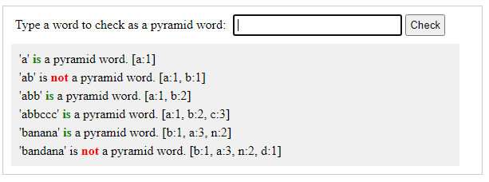

# Pyramid

A simple RESTful service in Spring Boot that accepts a string as input and return a response indicating whether a word is a pyramid word. A word is a pyramid word if you can arrange the letters in increasing frequency, starting with 1 and continuing without gaps and without duplicates.

__Examples__  
banana is a pyramid word because you have 1 'b', 2 'n's, and 3 'a's.  
bandana is not a pyramid word because you have 1 'b' and 1 'd'.

### Running
To run the sample, either:
- Open the project in Eclipse.

  > Open _SpringbootPyramidApplication.java_ and right click in the source window selecting __run as__ => __Spring Boot App__ from the context menu.

- Open a command prompt to the project directory root.

  > __mvn spring-boot:run__

- Using Postman
  > POST http://{server}:{port}/api/v1/pyramid/word  
  Content-Type: text  
  Accept: text  
  Body: {the word being checked}

With Spring Boot running, open the _index.html_ file in the browser. This file is found in the _client_ project folder.

Enter a word you would like to check, hit enter or click the __check__ button and look at the output for the answer.

### Notes

If using Postman to run the sample RESTful service then the return will be a string response of:  
- `'{word}' is a pyramid word.`  
or  
- `'{word}' is not a pyramid word.`

A simple connection test to the RESTful service can be performed with
  > GET http://{server}:{port}/api/v1/pyramid/test  

returning `test succeeded.` if successful.